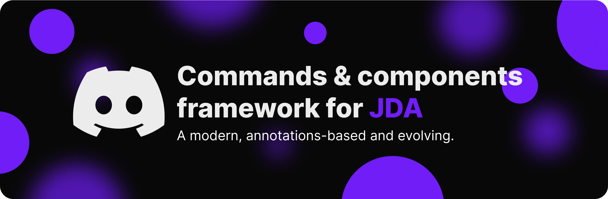

# JDA-Extra


---
Design: thanks to [@nelifs](https://github.com/nelifs)!

A modern and evolving commands & components framework for JDA. Inspired by [BotCommands](https://github.com/freya022/BotCommands) and motivated by [JDA-Utilities](https://github.com/JDA-Applications/JDA-Utilities).

# Useful links
* [Join to Discord for support](https://discord.gg/QN7Ef2KGkU)
* [Maven repository](https://repo.dwolfnineteen.com/)
* [Javadoc (latest)](https://repo.dwolfnineteen.com/javadoc/alpha/com/dwolfnineteen/JDA-Extra/latest)

# Getting started

> [!WARNING]
> We don't recommend using this framework in production until the first beta/stable release. In alpha versions and in the main branch, the library interface will break without any warning.

### Requirements
* JDK 8+

### Repositories for different release channels
* Stable releases: `https://repo.dwolfnineteen.com/releases` (e.g. `1.0.0`)
* Beta releases: `https://repo.dwolfnineteen.com/beta` (e.g. `1.0.0-beta.1`)
* Alpha releases: `https://repo.dwolfnineteen.com/alpha` (e.g. `1.0.0-alpha.1`) - **currently only this option is available**
* Experimental releases: `https://repo.dwolfnineteen.com/experimental` (e.g. `1.0.0-exp.1`)

### Installation

#### Gradle (Kotlin DSL):
```kotlin
repositories {
    mavenCentral()
    maven { url = uri("https://repo.dwolfnineteen.com/alpha") }
}

dependencies {
    implementation("com.dwolfnineteen:JDA-Extra:1.0.0-alpha.2")
}
```

#### Gradle (Groovy DSL):
```groovy
repositories {
    mavenCentral()
    maven { url "https://repo.dwolfnineteen.com/alpha" }
}

dependencies {
    implementation "com.dwolfnineteen:JDA-Extra:1.0.0-alpha.2"
}
```

#### Maven:
```xml
<repositories>
    <repository>
        <url>https://repo.dwolfnineteen.com/alpha</url>
    </repository>
</repositories>

<dependencies>
    <dependency>
        <groupId>com.dwolfnineteen</groupId>
        <artifactId>JDA-Extra</artifactId>
        <version>1.0.0-alpha.2</version>
    </dependency>
</dependencies>
```

### Beginning of the journey
Code examples will be added when the framework architecture stabilizes.

# Killer-features
* This solution is initially sharpened for the new Discord functionality and has a redesigned architecture
* Hybrid commands (maximally unified interface between prefix/slash commands)

# Special thanks


[JetBrains](https://www.jetbrains.com/) for [OSS development license](https://www.jetbrains.com/community/opensource/#support) and the best Java IDE!
